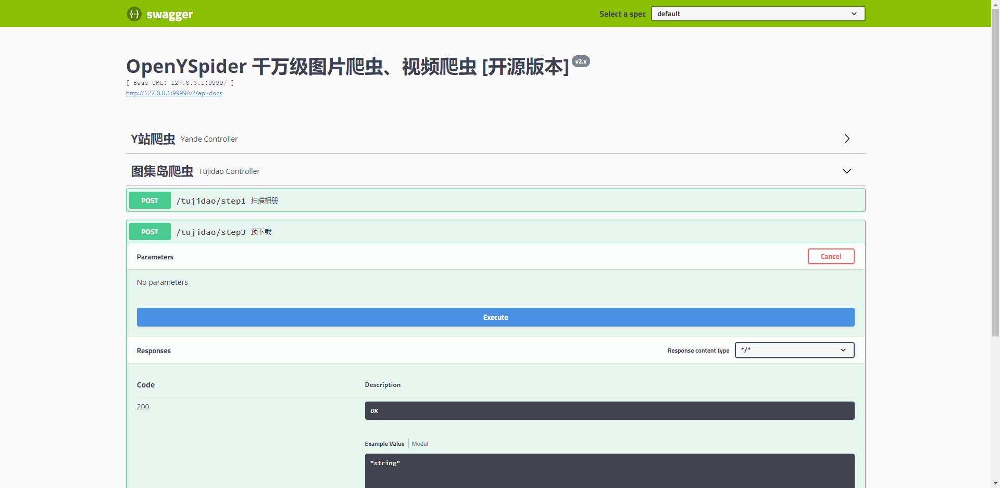

# OpenYspider 2.x

千万级图片、视频爬虫 [开源版本]：`tujidao.com`、`yande.re`、`meinvla.net`



注: `tangyun365.com`、`yalayi.com`、`rosmm88.com`、`mzsock.com`、`m7.22c.im` 请切换至 `1.x` 分支查看。

## 2.x 版本新特性

1. `Spring Boot` 版本升级: `2.1.8` => `2.2.1`
2. `jdk` 版本升级: `1.8` => `11`
3. `MySQL` 版本升级: `5.7` => `8.0`
4. `ORM` 框架调整: `JPA` => `Mybatis-Plus`
5. 引入 `swagger-ui` 最新版 `2.9.2`
6. 新增 `tujidao` 预下载特性
7. 移除 `llys、mzsock、rosi、tangyun、yalayi`
8. 数倍性能提升、数量级提升: `百万级` => `千万级`

## 爬取网站

### 1 图集岛（原美图日） [ 1,631,937P / 522G ]

- 目标网站：[http://www.tujidao.com/](http://www.tujidao.com/)
- 特点：图片路径可遍历

### 2 Y 站 [ 461,338P / 718G ]

- 目标网站：[https://yande.re/post](https://yande.re/post)
- 图片路径长、无相册概念

### 3 美女啦 [ 统计中 约 300w P ]

- 目标网站：[http://www.meinvla.net/](http://www.meinvla.net/)

## SQL 建表语句

```sql
# tbl_tujidao_album
CREATE TABLE `tbl_tujidao_album` (
  `id` bigint(20) NOT NULL AUTO_INCREMENT COMMENT '主键id',
  `state` int(11) DEFAULT NULL COMMENT '状态',
  `total` int(11) DEFAULT NULL COMMENT '图片总数',
  `album_name` varchar(255) DEFAULT NULL COMMENT '相册名',
  `album_id` int(11) DEFAULT NULL COMMENT '相册id',
  `type` int(11) DEFAULT NULL COMMENT '相册类型',
  PRIMARY KEY (`id`),
  UNIQUE KEY `album_id_UNIQUE` (`album_id`)
) ENGINE=InnoDB DEFAULT CHARSET=utf8mb4 COLLATE=utf8mb4_0900_ai_ci

# tbl_yande_image
CREATE TABLE `tbl_yande_image` (
  `id` bigint(20) NOT NULL AUTO_INCREMENT COMMENT '主键id',
  `img_name` varchar(10) DEFAULT NULL COMMENT '图片本地名',
  `img_url` varchar(500) DEFAULT NULL COMMENT '图片远端名',
  `state` int(11) DEFAULT NULL COMMENT '状态',
  PRIMARY KEY (`id`),
  UNIQUE KEY `img_naem_UNIQUE` (`img_name`)
) ENGINE=InnoDB DEFAULT CHARSET=utf8mb4 COLLATE=utf8mb4_0900_ai_ci

# tbl_meinvla_album
CREATE TABLE `tbl_meinvla_album` (
  `id` bigint(20) NOT NULL AUTO_INCREMENT COMMENT '主键id',
  `state` int(11) DEFAULT NULL COMMENT '状态',
  `album_name` varchar(255) DEFAULT NULL COMMENT '相册名',
  `album_id` int(11) DEFAULT NULL COMMENT '相册id',
  `type` int(11) DEFAULT NULL COMMENT '相册类型',
  PRIMARY KEY (`id`),
  UNIQUE KEY `album_id_UNIQUE` (`album_id`)
) ENGINE=InnoDB DEFAULT CHARSET=utf8mb4 COLLATE=utf8mb4_0900_ai_ci

# tbl_meinvla_image
CREATE TABLE `tbl_meinvla_image` (
  `id` bigint(20) NOT NULL AUTO_INCREMENT COMMENT '主键id',
  `img_name` varchar(64) DEFAULT NULL COMMENT '图片本地名',
  `img_url` varchar(500) DEFAULT NULL COMMENT '图片远端名',
  `album_id` int(11) DEFAULT NULL COMMENT '相册id',
  `state` int(11) DEFAULT NULL COMMENT '状态',
  PRIMARY KEY (`id`),
  UNIQUE KEY `img_naem_UNIQUE` (`img_name`)
) ENGINE=InnoDB DEFAULT CHARSET=utf8mb4 COLLATE=utf8mb4_0900_ai_ci
```

## 部分成果展示


