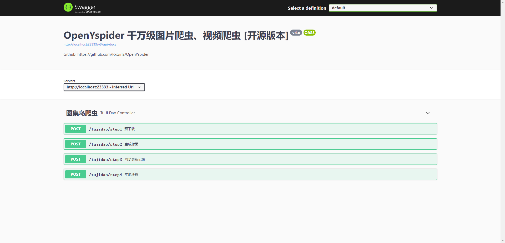

# OpenYspider 4.x

千万级图片、视频爬虫 [开源版本]



## 简介

OpenYspider 是一个使用 Java 编写的简单爬虫。主要用到的技术栈有：

1. spring-boot-starter-web
2. spring-boot-starter-test
3. mybatis-plus-boot-starter
4. springfox-boot-starter
5. lombok
6. jsoup
7. mockito + jacoco

当前 LTS 的网站有：

1. `tujidao.com`

Deprecated 的网站（请于历史提交中查看）：

1. `tangyun365.com`
2. `yalayi.com`
3. `rosmm88.com`
4. `mzsock.com`
5. `meinvla.net`
6. `leetcode-cn.com`

## 开发环境

`Windows 11` + `JDK 11` + `Mysql 8.0.x`

```sh
$ java --version
java 11.0.13 2021-10-19 LTS
Java(TM) SE Runtime Environment 18.9 (build 11.0.13+10-LTS-370)
Java HotSpot(TM) 64-Bit Server VM 18.9 (build 11.0.13+10-LTS-370, mixed mode)
```

运行启动类 `OpenYspiderApplication` 后，浏览器访问 [http://localhost:23333/swagger-ui/index.html#/](http://localhost:23333/swagger-ui/index.html#/)

## 爬取网站

数据统计截止 2021-07-04

### 1 图集岛（原美图日） [ 1,631,937P / 522G ]

- 目标网站：[http://www.tujidao.com/](http://www.tujidao.com/)
- 特点：图片路径可遍历

### 2 美女啦 [ 图片+视频 约 783w P / 397G ]

- 目标网站：[http://www.meinvla.net/](http://www.meinvla.net/)

## 部分成果展示


